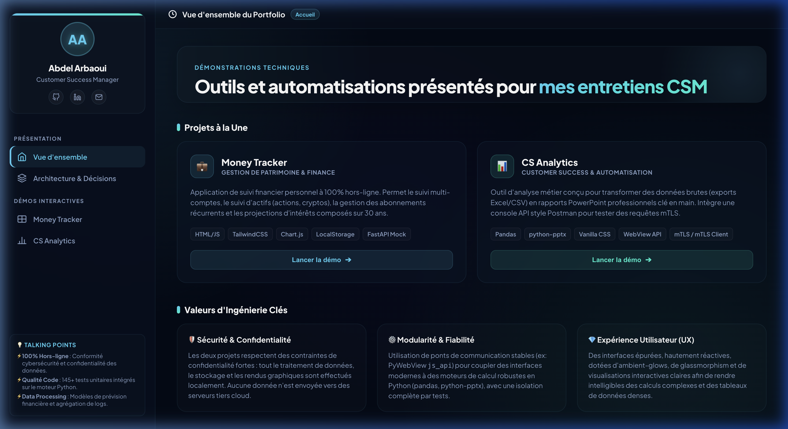
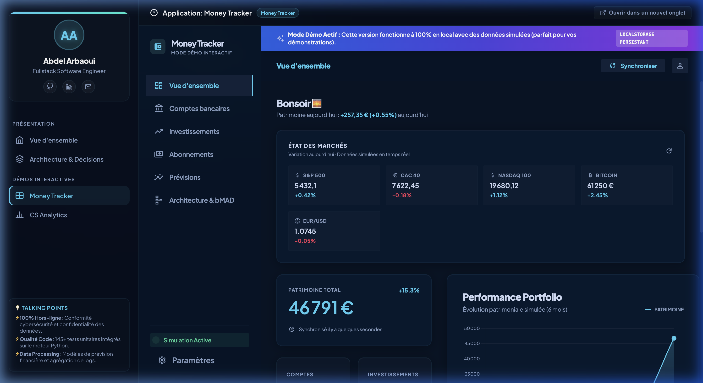
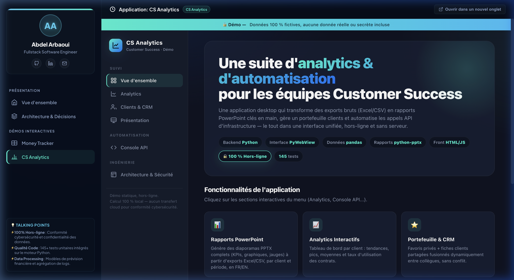

# Customer Success & Automation Portfolio — Abdel Arbaoui

Welcome to my technical demo portfolio. This repository brings together interactive tools designed to optimize Customer Success operations and automate business workflows.

## 📸 Visual Overview



<p align="center">
  
  
</p>

<p align="center">
  <i>Left: Money Tracker (personal project). Right: CS Analytics (reporting engine).</i>
</p>

> 🎥 **Demo animation:** [Watch the interactive portfolio recording (WebP)](assets/demo_recording.webp)

## 📂 Repository Structure

The portfolio uses a modular structure. Each project remains independent while being accessible from the main portal:

```text
portfolio-portal/
├── index.html               # Main navigation portal using iframes
├── README.md                # Project documentation
├── assets/                  # Screenshots and demo media
├── money-tracker/
│   └── index.html           # Money Tracker interactive application
└── CS-Analytics/
    └── index.html           # CS Analytics interactive application
```

---

## 🚀 Running the Portfolio

1. Open the `portfolio-portal` directory.
2. Open or double-click [index.html](index.html).
3. Use the left sidebar to switch between the two projects.
4. Use the `FR/EN` button to change the language across the portal and both applications.

---

## 📊 Featured Projects

### 1. Money Tracker — Personal Wealth Management

A personal finance and investment portfolio tracker designed to run entirely offline.

- **Core features:** Multiple-account tracking, asset management for stocks and cryptocurrencies, recurring subscription calendar, and 30-year compound-interest simulations.
- **Technologies:** HTML/JavaScript, Tailwind CSS, Chart.js CDN, persistent LocalStorage, and local FastAPI simulations.

### 2. CS Analytics — Customer Success Operations & Automation

A business analytics dashboard that consolidates log exports and transforms them into client activity reports in PowerPoint format.

- **Core features:** SecureDrive and TeamChat usage analytics, a Postman-style request console with secure mTLS authentication through temporary PEM certificates, and a dual-screen presentation mode.
- **Technologies:** pandas, python-pptx, WebView2 through PyWebView, and vanilla CSS.

---

## 🛡️ Engineering Principles

- **100% client-side and offline:** All analytics and financial data remain local. No data is transmitted to third-party public cloud services.
- **Quality and reliability:** More than 145 Python unit tests cover calculation algorithms, data merging, and concurrent timestamp resolution.
- **Modern user experience:** A consistent dark theme, micro-interactions, responsive interfaces, and seamless iframe integration for presentations.

---

## ✉️ Contact

- **LinkedIn:** [Abdelkader Arbaoui](https://www.linkedin.com/in/abdelkader-arbaoui-423852197/)
- **GitHub:** [AbdelArbaoui](https://github.com/AbdelArbaoui)
- **Email:** [abdelarbb@gmail.com](mailto:abdelarbb@gmail.com)
